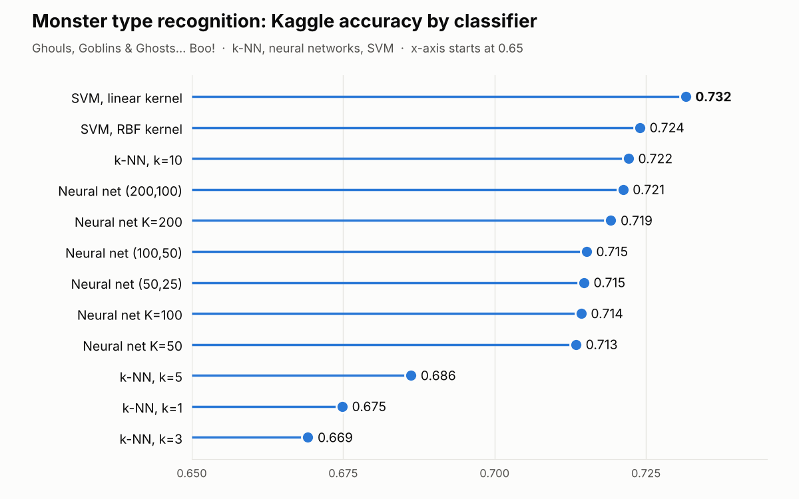

# 👻 Monster Type Recognition

*Ghouls, Goblins and Ghosts... Boo!* — a comparison of four classic machine-learning classifiers on a Kaggle dataset.

Coursework for **Machine Learning** (undergraduate), Department of Computer Science & Engineering, University of Ioannina, academic year 2021–22.

---

## The problem

Given five numeric features of a "monster", predict whether it is a **Ghoul**, a **Goblin** or a **Ghost**.

| Feature | Type | Notes |
|---|---|---|
| `bone_length` | continuous | |
| `rotting_flesh` | continuous | |
| `hair_length` | continuous | |
| `has_soul` | continuous | |
| `color` | discrete (6 values) | `clear, white, green, blue, black, blood` → mapped to `{1/6, 2/6, …, 1}` so it lies in `[0, 1]` like the other features |

Dataset: the Kaggle competition
[Ghouls, Goblins, and Ghosts... Boo!](https://www.kaggle.com/competitions/ghouls-goblins-and-ghosts-boo/overview)
(371 labelled training samples, 529 test samples).

## Methods

| # | Method | Configuration |
|---|---|---|
| 1 | **k-Nearest Neighbors** | Euclidean distance, distance-weighted votes, `k = 1, 3, 5, 10` |
| 2 | **Neural networks** (Keras) | sigmoid hidden layers, 3-neuron softmax output, Stochastic Gradient Descent, 50 epochs. One hidden layer: `K = 50, 100, 200`. Two hidden layers: `(K1, K2) = (50,25), (100,50), (200,100)` |
| 3 | **Support Vector Machines** | one-versus-rest. Linear kernel (`C = 10`) and Gaussian RBF kernel (several `gamma` values) |
| 4 | **Naive Bayes** | written from scratch: normal distribution for the 4 continuous features, multinomial distribution (Laplace-smoothed) for `color`, computed in log-space |

Metrics: accuracy and weighted F1 / precision / recall.

## Results

The labels of the Kaggle test set are hidden, so the official **accuracy** below comes from uploading the generated submission files to Kaggle (see the full discussion in the report: [`docs/report.docx`](docs/report.docx) / [`docs/report.pdf`](docs/report.pdf)).

| Method | Setting | Kaggle accuracy |
|---|---|---|
| k-NN | k = 1 | 0.67485 |
| k-NN | k = 3 | 0.66918 |
| k-NN | k = 5 | 0.68620 |
| k-NN | k = 10 | 0.72211 |
| Neural network | K = 50 | 0.71345 |
| Neural network | K = 100 | 0.71430 |
| Neural network | K = 200 | 0.71921 |
| Neural network | (50, 25) | 0.71475 |
| Neural network | (100, 50) | 0.71518 |
| Neural network | (200, 100) | 0.72121 |
| SVM | linear kernel | **0.73156** |
| SVM | RBF kernel | 0.72400 |
| Naive Bayes | Gaussian + multinomial | _not yet submitted_ |



**Best method: SVM with a linear kernel (accuracy 0.73156)**, closely followed by the RBF-kernel SVM, the largest neural network and k-NN with k = 10. All methods land within ~6 points of each other, which is expected on such a small dataset where the classes overlap heavily.

## Project structure

```
monster-classification/
├── src/
│   └── monster_classifiers.py   # all four methods + evaluation + submission export
├── docs/
│   ├── report.docx              # the written report (Word)
│   ├── report.pdf               # the same report as PDF
│   └── kaggle_accuracy.png      # results chart used in the README
├── data/                        # put train.csv and test.csv here (not tracked)
├── requirements.txt
└── README.md
```

## How to run

**1. Install the dependencies** (Python 3.9+)

```bash
python -m venv .venv
source .venv/bin/activate        # Windows: .venv\Scripts\activate
pip install -r requirements.txt
```

**2. Get the data.** Download `train.csv` and `test.csv` from the
[Kaggle competition page](https://www.kaggle.com/competitions/ghouls-goblins-and-ghosts-boo/data)
and place them in the `data/` folder. They are not included in this repository because they belong to Kaggle.

**3. Run**

```bash
python src/monster_classifiers.py
```

Run it from the project root. The whole assignment lives in this single file, written step by step with detailed comments. The few settings you may want to change are constants at the top of the file:

| Setting | Default | Description |
|---|---|---|
| `DATA_DIR` | `"data"` | folder containing `train.csv` and `test.csv` |
| `OUT_DIR` | `"submissions"` | where the output files are written |
| `VAL_SIZE` | `0.2` | fraction of `train.csv` held out for local validation |
| `EPOCHS` | `50` | training epochs for the neural networks |
| `RUN_NEURAL_NETWORKS` | `True` | set to `False` to skip the (slower) neural networks |
| `SEED` | `42` | random seed |

**What the script does for every model**

1. Trains on 80 % of `train.csv` and prints accuracy / F1 / precision / recall on the remaining 20 % (stratified split), so that you get a meaningful local estimate.
2. Re-trains on the **whole** `train.csv` and writes `submissions/submission_<model>.csv` (columns `id,type`), ready to upload to Kaggle (*Submit Predictions*) to get the official score.
3. Saves a ranked table to `submissions/validation_summary.csv`.

> The local validation numbers will not be identical to the Kaggle scores: they are computed on a different (smaller) sample.

## Implementation notes

- **Color encoding:** the six colors are mapped to `{1/6, …, 1}`. Naive Bayes recovers the integer category from this value to apply the multinomial model.
- **Neural networks:** class names are converted with a `LabelEncoder` and converted back with `inverse_transform`, so the predicted class names are always correct, regardless of label ordering.
- **SVM:** multi-class handled explicitly with `OneVsRestClassifier`; the RBF kernel is tried with `gamma ∈ {scale, 0.1, 1, 10}`.
- **Naive Bayes:** class means and (unbiased, `n-1`) variances are estimated from the training set; computations use log-probabilities for numerical stability.
- With only 50 epochs of plain SGD the networks can under-fit on some splits — try `EPOCHS = 500` and compare.

## Authors

_Add your name(s) here._

## License

_Add a license of your choice (e.g. MIT) if you want others to reuse the code._
